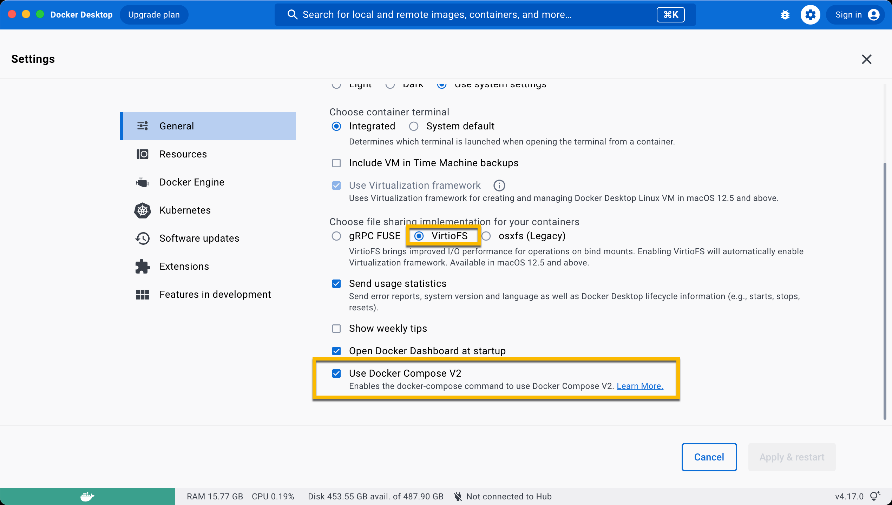

# Single Node Configuration

## Using Single Node Configuration

Single node configuration simulates the network’s functions on a smaller scale (single node), ideal for debugging, testing, and prototype development.

<details>

<summary><strong>Single Node Mode Requirements</strong></summary>

Ensure the **`VirtioFS`** file sharing implementation is enabled in the docker settings.



Ensure the following configurations are set at minimum in Docker **Settings** -> **Resources** and are available for use:

**CPUs:** 6

**Memory:** 8GB

**Swap:** 1 GB

**Disk Image Size:** 64 GB


Ensure the **`Allow the default Docker sockets to be used (requires password)`** is enabled in Docker **Settings -> Advanced**.


**Note:** The image may look different if you are on a different version

</details>

#### **Starting and Stopping Node**

Before launching the network commands, confirm that Docker is installed and open on your machine. To stop your local node, use the following `npm` or `docker` commands. Before proceeding with this operation, make sure to back up any manually created files in the working directory.

<details>

<summary><strong>npm commands</strong></summary>


```bash
# npm command to start the local network and generate accounts in detached mode
npm run start -- -d

# npm command to stop
npm run stop

# npm command to restart node
npm run restart
```


</details>

<details>

<summary><strong>docker commands</strong></summary>

```bash
# Docker command to start the local network. Does not generate accounts
docker compose up -d

# Docker command to stop services
docker compose stop

# Docker command to restart local network
docker compose restart

# Docker command to stop local network and remove containers
docker compose down
```

</details>

Alternatively, run `docker compose down -v; git clean -xfd; git reset --hard` to stop the local node and reset it to its original state. The full list of available commands can be found [here](https://github.com/hashgraph/hedera-local-node?tab=readme-ov-file#commands).

#### Single Node Mode Diagram

The following diagram illustrates the architecture and flow of data in single node mode.

<figure><figcaption><p>Single node mode diagram</p></figcaption></figure>
