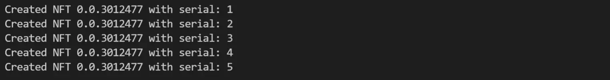
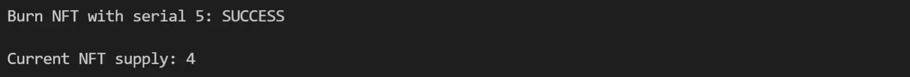
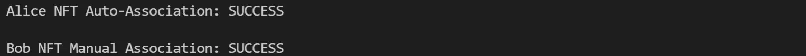
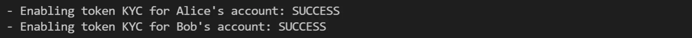

# Hedera Token Service (HTS)

Hedera Token Service (HTS) enables you to configure, mint, and manage tokens on the Hedera network without the need to set up and deploy a smart contract. Tokens are as fast, fair, and secure as hbar and cost a fraction of 1¢ USD to transfer.

Let’s look at some of the functionality available to you with HTS. You will see that the ease of use and flexibility this service provides make HTS tokens an excellent alternative to tokens with smart contracts on Ethereum. For those coming from Ethereum, HTS functionality can be mapped to multiple types of ERC token standards including ERC20, ERC721, and ERC1155 – you can learn more about the mapping in this blog post. And starting in early 2022, you will be able to use HTS with smart contracts for those use cases where you need advanced logic and programmability for your tokens.

In this part of the series, you will learn how to:

* Create a custom fee schedule&#x20;
* Configure a **non-fungible token (NFT)**&#x20;
* Mint and burn NFTs&#x20;
* Associate and Transfer NFTs&#x20;

We will configure an NFT art collection for autumn images. Note that with HTS you can also create **fungible** tokens that can represent anything from a stablecoin pegged to the USD value, or an in-game reward system.

> **Note:** To make sure you have everything you need to follow along, be sure to check out these [getting started resources](https://docs.hedera.com/guides/getting-started/introduction). There, you will see how to create a Hedera testnet account, and then you can configure your development environment. If you want the entire code used, skip to the [Code Check](https://hedera.com/blog/get-started-with-the-hedera-token-service-part-1-how-to-mint-nfts) section below.

## Demos



#### Code Check





**Code Check**





**Code Check**



## Create a Custom Fee Schedule

Let’s start by defining the custom fees for the NFT. [Custom fees](https://docs.hedera.com/guides/docs/sdks/tokens/custom-token-fees) are distributed to the specified accounts each time the token is transferred. Depending on the token type (fungible or non-fungible), you can specify a custom fee to be fixed, fractional, or a royalty. An NFT can only have fixed or royalty fees, so in this example, we’ll go with a royalty fee. This enables collecting a fraction of the value exchanged for the NFT when ownership is transferred from one person to another.

```javascript
// DEFINE CUSTOM FEE SCHEDULE
    let nftCustomFee = await new CustomRoyaltyFee()
        .setNumerator(5)
        .setDenominator(10)
        .setFeeCollectorAccountId(treasuryId)
        .setFallbackFee(new CustomFixedFee().setHbarAmount(new Hbar(200)));
```

> **Note**: while most of the following examples are in JavaScript, official SDKs supporting [Go](https://docs.hedera.com/guides/docs/sdks/tokens/define-a-token) and [Java](https://docs.hedera.com/guides/docs/sdks/tokens/define-a-token) are also available and implemented very similarly, alongside community-supported SDKs in [.NET](https://hedera.com/blog/creating-tokens-hedera-net-part-1) and various other frameworks or languages.

## Create a Non-Fungible Token (NFT)

These are the images for our NFT collection.

<figure><figcaption></figcaption></figure>

The images and their metadata live in the InterPlanetary File System (IPFS), which provides decentralized storage. We will need the metadata when we start minting NFTs in the next section. For the metadata, we use the standard in [this specification](https://hips.hedera.com/hip/hip-412).&#x20;

These are the content identifiers (CIDs) for the NFT metadata, which points to the images and below is a sample of the metadata:

```javascript
// IPFS CONTENT IDENTIFIERS FOR WHICH WE WILL CREATE NFTs
CID = [
    "ipfs://bafyreie3ichmqul4xa7e6xcy34tylbuq2vf3gnjf7c55trg3b6xyjr4bku/metadata.json",
    "ipfs://bafyreicfldhlnndodwm4xe7473e2gkhyu5frhsb5rvcyq5hv4jao7f6uvu/metadata.json",
    "ipfs://bafyreia6ow6phsk7gdef6kzlgagfamxmujp47ue7rxymo6wr2qtenrzaeu/metadata.json",
    "ipfs://bafyreiax45o6ardirmfk6ua37vbnlkgpvwklntlqh5z5ohsby3tk5ep7oe/metadata.json",
    "ipfs://bafyreia34awv7lszb7nia2yiwsbbbefdkbr3buo22wbgk3mwwmuhk2rsby/metadata.json",
];
```

```javascript
{
  "name": "LEAF1.jpg",
  "creator": "Mother Nature",
  "description": "Autumn",
  "type": "image/jpg",
  "format": "none",
  "properties": {
    "city": "Boston",
    "season": "Fall",
    "decade": "20's"
  },
  "image": "ipfs://bafybeig35bheyqpi4qlnuljpok54ud753bnp62fe6jit343hv3oxhgnbfm/LEAF1.jpg"
}
```

Now, let’s [create the token](https://docs.hedera.com/guides/docs/sdks/tokens/define-a-token). Use _**TokenCreateTransaction()**_ to configure and set the token properties. At a minimum, this constructor requires setting a name, symbol, and treasury account ID. All other fields are optional, so if they’re not specified then default values are used. For instance, not specifying an _admin key_, makes a token immutable (can’t change or add properties); not specifying a _supply key_, makes a token supply fixed (can’t mint new or burn existing tokens); not specifying a _token type_, makes a token fungible; for more info on the defaults check out the documentation.

After submitting the transaction to the Hedera network, you can obtain the new token ID by requesting the receipt. This token ID represents an NFT class.

```javascript
// CREATE NFT WITH CUSTOM FEE
    let nftCreate = await new TokenCreateTransaction()
        .setTokenName("Fall Collection")
        .setTokenSymbol("LEAF")
        .setTokenType(TokenType.NonFungibleUnique)
        .setDecimals(0)
        .setInitialSupply(0)
        .setTreasuryAccountId(treasuryId)
        .setSupplyType(TokenSupplyType.Finite)
        .setMaxSupply(CID.length)
        .setCustomFees([nftCustomFee])
        .setAdminKey(adminKey)
        .setSupplyKey(supplyKey)
        .setPauseKey(pauseKey)
        .setFreezeKey(freezeKey)
        .setWipeKey(wipeKey)
        .freezeWith(client)
        .sign(treasuryKey);

    let nftCreateTxSign = await nftCreate.sign(adminKey);
    let nftCreateSubmit = await nftCreateTxSign.execute(client);
    let nftCreateRx = await nftCreateSubmit.getReceipt(client);
    let tokenId = nftCreateRx.tokenId;
    console.log(`Created NFT with Token ID: ${tokenId} \n`);

    // TOKEN QUERY TO CHECK THAT THE CUSTOM FEE SCHEDULE IS ASSOCIATED WITH NFT
    var tokenInfo = await new TokenInfoQuery().setTokenId(tokenId).execute(client);
    console.table(tokenInfo.customFees[0]);
```

#### Console output:

<figure><figcaption></figcaption></figure>

## Mint and Burn NFTs

In the code above for the NFT creation, the decimals and initial supply must be set to zero. Once the token is created, you will have to mint each NFT using the token mint operation. Specifying a _supply key_ during token creation is a requirement to be able to [mint](https://docs.hedera.com/guides/docs/sdks/tokens/mint-a-token) and [burn](https://docs.hedera.com/guides/docs/sdks/tokens/burn-a-token) tokens.

In terms of use cases, you may want to mint new NFTs to add items to your NFT class, or you may need to burn NFTs to take a specific item out of circulation. Alternatively, if you’re working with a fungible token (like a stablecoin), you may want to mint new tokens every time there is a new deposit and burn tokens anytime that someone converts their tokens back into fiat.

In this case, we’re creating a batch of five NFTs for a collection of five images. We’ll use a “token minter” function and a _for_ loop to speed up the batch NFT minting from our array of content identifiers (CID array):

```javascript
 // MINT NEW BATCH OF NFTs
    nftLeaf = [];
    for (var i = 0; i < CID.length; i++) {
        nftLeaf[i] = await tokenMinterFcn(CID[i]);
        console.log(`Created NFT ${tokenId} with serial: ${nftLeaf[i].serials[0].low}`);
    }
```

```javascript
// TOKEN MINTER FUNCTION ==========================================
    async function tokenMinterFcn(CID) {
        mintTx = await new TokenMintTransaction()
            .setTokenId(tokenId)
            .setMetadata([Buffer.from(CID)])
            .freezeWith(client);
        let mintTxSign = await mintTx.sign(supplyKey);
        let mintTxSubmit = await mintTxSign.execute(client);
        let mintRx = await mintTxSubmit.getReceipt(client);
        return mintRx;
    }
```

#### Console output:

<figure><figcaption></figcaption></figure>

If you change your mind and decide that you don’t need the last NFT, then you can burn it as follows:

```javascript
 // BURN THE LAST NFT IN THE COLLECTION
    let tokenBurnTx = await new TokenBurnTransaction()
        .setTokenId(tokenId)
        .setSerials([CID.length])
        .freezeWith(client)
        .sign(supplyKey);
    let tokenBurnSubmit = await tokenBurnTx.execute(client);
    let tokenBurnRx = await tokenBurnSubmit.getReceipt(client);
    console.log(`\nBurn NFT with serial ${CID.length}: ${tokenBurnRx.status} \n`);

    var tokenInfo = await new TokenInfoQuery().setTokenId(tokenId).execute(client);
    console.log(`Current NFT supply: ${tokenInfo.totalSupply} \n`);
```

#### Console output:

<figure><figcaption></figcaption></figure>

## Auto-Associate and Transfer NFTs

Before an account that is not the treasury for a token can receive or send this specific token ID, it must become “associated” with the token — this helps reduce unwanted spam and other concerns from users that don’t want to be associated with any of the variety of tokens that are created on the Hedera network.

This association between an account and a token ID can be done in two ways, [manually](https://docs.hedera.com/guides/docs/sdks/tokens/associate-tokens-to-an-account) or automatically. Note that **automatic associations** can be done for both [existing](https://docs.hedera.com/guides/docs/sdks/cryptocurrency/update-an-account) and [newly created](https://docs.hedera.com/guides/docs/sdks/cryptocurrency/create-an-account) accounts. For the purposes of our example, we’ll do both.

* Alice’s account will be updated to associate with the token automatically
* Bob’s account will be manually associated with the token ID

```javascript
 // AUTO-ASSOCIATION FOR ALICE'S ACCOUNT
    let associateTx = await new AccountUpdateTransaction()
        .setAccountId(aliceId)
        .setMaxAutomaticTokenAssociations(100)
        .freezeWith(client)
        .sign(aliceKey);
    let associateTxSubmit = await associateTx.execute(client);
    let associateRx = await associateTxSubmit.getReceipt(client);
    console.log(`Alice NFT Auto-Association: ${associateRx.status} \n`);
    
    // MANUAL ASSOCIATION FOR BOB'S ACCOUNT
    let associateBobTx = await new TokenAssociateTransaction()
        .setAccountId(bobId)
        .setTokenIds([tokenId])
        .freezeWith(client)
        .sign(bobKey);
    let associateBobTxSubmit = await associateBobTx.execute(client);
    let associateBobRx = await associateBobTxSubmit.getReceipt(client);
    console.log(`Bob NFT Manual Association: ${associateBobRx.status} \n`);
```

#### Console output:

<figure><figcaption></figcaption></figure>

Finally, let’s do two [transfers](https://docs.hedera.com/guides/docs/sdks/tokens/transfer-tokens) of the NFT with serial number **2** and see how the royalty fees are collected. The first transfer will be from the Treasury to Alice, and the second NFT transfer will be from Alice to Bob in exchange for 100 hbar.

### NFT Transfer from Treasury to Alice

Now, let’s do the first NFT transfer and check the account balances before and after the send.

```javascript
 // BALANCE CHECK 1
    oB = await bCheckerFcn(treasuryId);
    aB = await bCheckerFcn(aliceId);
    bB = await bCheckerFcn(bobId);
    console.log(`- Treasury balance: ${oB[0]} NFTs of ID:${tokenId} and ${oB[1]}`);
    console.log(`- Alice balance: ${aB[0]} NFTs of ID:${tokenId} and ${aB[1]}`);
    console.log(`- Bob balance: ${bB[0]} NFTs of ID:${tokenId} and ${bB[1]}`);

    // 1st TRANSFER NFT Treasury->Alice
    let tokenTransferTx = await new TransferTransaction()
        .addNftTransfer(tokenId, 2, treasuryId, aliceId)
        .freezeWith(client)
        .sign(treasuryKey);
    let tokenTransferSubmit = await tokenTransferTx.execute(client);
    let tokenTransferRx = await tokenTransferSubmit.getReceipt(client);
    console.log(`\n NFT transfer Treasury->Alice status: ${tokenTransferRx.status} \n`);

    // BALANCE CHECK 2: COPY/PASTE THE CODE ABOVE IN BALANCE CHECK 1java
```

```javascript
// BALANCE CHECKER FUNCTION ==========================================
    async function bCheckerFcn(id) {
        balanceCheckTx = await new AccountBalanceQuery().setAccountId(id).execute(client);
        return [balanceCheckTx.tokens._map.get(tokenId.toString()), balanceCheckTx.hbars];
    }
```

**Console output:**

<figure><figcaption></figcaption></figure>

As you remember from the [Custom Token Fees documentation](https://docs.hedera.com/guides/docs/sdks/tokens/custom-token-fees), the treasury account and any fee-collecting accounts for a token are exempt from paying custom transaction fees when the token is transferred. Since the treasury account is also the fee collector for the token, that means there are no royalty fees collected in this first transfer.

### NFT Transfer from Alice to Bob

```javascript
 // 2nd NFT TRANSFER NFT Alice->Bob
    let tokenTransferTx2 = await new TransferTransaction()
        .addNftTransfer(tokenId, 2, aliceId, bobId)
        .addHbarTransfer(aliceId, 100)
        .addHbarTransfer(bobId, -100)
        .freezeWith(client)
        .sign(aliceKey);
    tokenTransferTx2Sign = await tokenTransferTx2.sign(bobKey);
    let tokenTransferSubmit2 = await tokenTransferTx2Sign.execute(client);
    let tokenTransferRx2 = await tokenTransferSubmit2.getReceipt(client);
    console.log(`\n NFT transfer Alice->Bob status: ${tokenTransferRx2.status} \n`);

    // BALANCE CHECK 3: COPY/PASTE THE CODE ABOVE IN BALANCE CHECK 1
```

#### Console output:

<figure><figcaption></figcaption></figure>

Remember from the documentation that royalty fees are paid from the fungible value exchanged, which was 100 hbar in this case. The royalty fee is specified to be 50%, so that’s why the treasury collects 50 hbar and Alice collects the remaining 50 hbar. Keep in mind that when there’s no exchange of fungible value (like hbar or a fungible token), the fallback fee is charged (currently 200 hbar in our custom fee schedule).

## KYC Key

When you [create a token](https://docs.hedera.com/guides/docs/sdks/tokens/define-a-token) with HTS, you can optionally use the _**.setKycKey(\<key>)**_ method to enable this _**\<key>**_ to grant (or revoke) KYC status of other accounts so they can transact with your token. You would consider using the KYC flag when you need your token to be used only within parties that have been “authorized” to use it. For instance, known registered users, or those who have passed identity verification. Think of this as identity and compliance features like anti-money laundering (AML) requirements, or any type of off-ledger authentication mechanism, like if a user has signed up for your application.

The _**.setKycKey(\<key>)**_ method is not required when you create your token, so if you don’t use the method that means anyone who is [associated with your token](https://docs.hedera.com/guides/docs/sdks/tokens/associate-tokens-to-an-account) can transact without having to be “authorized”. No KYC key also means that KYC grants or revoke operations are not possible for the token in the future.

## Enable Token KYC on an Account

We will continue with the NFT example from [Part 1](https://hedera.com/blog/get-started-with-the-hedera-token-service-part-1-how-to-mint-nfts). However, we have to create a new token using _**.setKycKey(\<key>)**_. Before users can transfer the newly created token, we must grant KYC to those users, namely Alice and Bob.

```javascript
    // ENABLE TOKEN KYC FOR ALICE AND BOB
    let aliceKyc = await kycEnableFcn(aliceId);
    let bobKyc = await kycEnableFcn(bobId);
    console.log(`- Enabling token KYC for Alice's account: ${aliceKyc.status}`);
    console.log(`- Enabling token KYC for Bob's account: ${bobKyc.status}\n`);
```

```javascript
    // KYC ENABLE FUNCTION ==========================================
    async function kycEnableFcn(id) {
        let kycEnableTx = await new TokenGrantKycTransaction()
            .setAccountId(id)
            .setTokenId(tokenId)
            .freezeWith(client)
            .sign(kycKey);
        let kycSubmitTx = await kycEnableTx.execute(client);
        let kycRx = await kycSubmitTx.getReceipt(client);
        return kycRx;
    }
```

**Console output:**

<figure><figcaption></figcaption></figure>

## Disable Token KYC on an Account

After the KYC flag has been set to true for a user, the administrator, identity provider, or compliance manager can revoke or disable the KYC flag. After KYC is disabled for a user, he or she can longer receive or send that token. Here’s a sample code for disabling token KYC on Alice’s account:

```javascript
    // DISABLE TOKEN KYC FOR ALICE
    let kycDisableTx = await new TokenRevokeKycTransaction()
        .setAccountId(aliceId)
        .setTokenId(tokenId)
        .freezeWith(client)
        .sign(kycKey);
    let kycDisableSubmitTx = await kycDisableTx.execute(client);
    let kycDisableRx = await kycDisableSubmitTx.getReceipt(client);
    console.log(`- Disabling token KYC for Alice's account: ${kycDisableRx.status} \n`);
```

**Console output:**

<figure><figcaption></figcaption></figure>

**Note**: The following sections require that Alice has token KYC enabled.

## Updating tokens

If you create a token using the _**.setAdminKey(\<key>)**_ method, then you can “update” that token, meaning change its metadata and characteristics. For instance, you can change the token name, symbol, or the keys that are associated with its [controlled mutability](https://hedera.com/blog/code-is-law-but-what-if-the-law-needs-to-change). You could create a token that initially has a 1-of-1 key for minting and burning, and over time, change this to a [threshold](https://docs.hedera.com/guides/docs/sdks/keys/create-a-threshold-key) or multi-signature key. You can rotate the keys associated with compliance and administration or even remove them entirely, offering a more decentralized approach over time.

On the other hand, if you create a token without using _**.setAdminKey(\<key>)**_, then that token is immutable and its properties cannot be modified.

In our example, we start by checking the initial KYC key for the token, then we update the KYC key from _**\<kycKey>**_ to _**\<newKycKey>**_, and then we query the token again to make sure the key change took place.

```javascript
    // QUERY TO CHECK INITIAL KYC KEY
    var tokenInfo = await tQueryFcn();
    console.log(`- KYC key for the NFT is: \n${tokenInfo.kycKey.toString()} \n`);

    // UPDATE TOKEN PROPERTIES: NEW KYC KEY
    let tokenUpdateTx = await new TokenUpdateTransaction()
        .setTokenId(tokenId)
        .setKycKey(newKycKey)
        .freezeWith(client)
        .sign(adminKey);
    let tokenUpdateSubmitTx = await tokenUpdateTx.execute(client);
    let tokenUpdateRx = await tokenUpdateSubmitTx.getReceipt(client);
    console.log(`- Token update transaction (new KYC key): ${tokenUpdateRx.status} \n`);

    // QUERY TO CHECK CHANGE IN KYC KEY
    var tokenInfo = await tQueryFcn();
    console.log(`- KYC key for the NFT is: \n${tokenInfo.kycKey.toString()}`);
```

```javascript
    // TOKEN QUERY FUNCTION ==========================================
    async function tQueryFcn() {
        var tokenInfo = await new TokenInfoQuery().setTokenId(tokenId).execute(client);
        return tokenInfo;
    }
```

**Console output:**

<figure><figcaption></figcaption></figure>

## Schedule Transactions

Scheduled transactions enable you to collect the required signatures for a transaction in preparation for its execution. This can be useful if you don’t have all the required signatures for the network to immediately process the transaction. Currently, you can schedule: _**TransferTransaction()**_ (for hbar and HTS tokens), _**TokenMintTransaction()**_, _**TokenBurnTransaction()**_, and _**TopicMessageSubmitTransaction()**_. More transactions are supported with new releases.

Now, we will schedule a token transfer from Bob to Alice using [scheduled transactions](https://docs.hedera.com/guides/core-concepts/scheduled-transaction). This token transfer requires signatures from both parties.

Given that we don’t have Alice’s and Bob’s signatures immediately available (for the purposes of this example), we first create the NFT transfer without signatures. Then, we [create the scheduled transaction](https://docs.hedera.com/guides/docs/sdks/schedule-transaction/create-a-schedule-transaction) using the constructor _**ScheduleCreateTransaction()**_, and specify the NFT transfer as the transaction to schedule using the _**.setScheduledTransaction()**_ method.


```javascript
    // CREATE THE NFT TRANSFER FROM BOB->ALICE TO BE SCHEDULED
    // REQUIRES ALICE'S AND BOB'S SIGNATURES
    let txToSchedule = new TransferTransaction()
        .addNftTransfer(tokenId, 2, bobId, aliceId)
        .addHbarTransfer(aliceId, -200)
        .addHbarTransfer(bobId, 200);

    // SCHEDULE THE NFT TRANSFER TRANSACTION CREATED IN THE LAST STEP
    let scheduleTx = await new ScheduleCreateTransaction().setScheduledTransaction(txToSchedule).execute(client);
    let scheduleRx = await scheduleTx.getReceipt(client);
    let scheduleId = scheduleRx.scheduleId;
    let scheduledTxId = scheduleRx.scheduledTransactionId;
    console.log(`- The schedule ID is: ${scheduleId}`);
    console.log(`- The scheduled transaction ID is: ${scheduledTxId} \n`);
```

**Console output:**

<figure><figcaption></figcaption></figure>

The token transfer is now scheduled, and it will be executed as soon as all required signatures are submitted. Note that the scheduled transaction IDs (_**scheduledTxId**_ in this case) have a “scheduled” flag that you can use to confirm the status of the transaction.

As of the time of this writing, a scheduled transaction has 30 minutes to collect all the required signatures before it can be executed or it expires (deleted from the network). If you set a _**\<AdminKey>**_ for the scheduled transaction, then you can delete it before its execution or expiration.

Now, we [submit the required signatures](https://docs.hedera.com/guides/docs/sdks/schedule-transaction/sign-a-schedule-transaction) and [get scheduled information](https://docs.hedera.com/guides/docs/sdks/schedule-transaction/get-schedule-info) to check the status of our transfer.

```javascript
    // SUBMIT ALICE'S SIGNATURE FOR THE TRANSFER TRANSACTION
    let aliceSignTx = await new ScheduleSignTransaction().setScheduleId(scheduleId).freezeWith(client).sign(aliceKey);
    let aliceSignSubmit = await aliceSignTx.execute(client);
    let aliceSignRx = await aliceSignSubmit.getReceipt(client);
    console.log(`- Status of Alice's signature submission: ${aliceSignRx.status}`);

    // QUERY TO CONFIRM IF THE SCHEDULE WAS TRIGGERED (SIGNATURES HAVE BEEN ADDED)
    scheduleQuery = await new ScheduleInfoQuery().setScheduleId(scheduleId).execute(client);
    console.log(`- Schedule triggered (all required signatures received): ${scheduleQuery.executed !== null}`);

    // SUBMIT BOB'S SIGNATURE FOR THE TRANSFER TRANSACTION
    let bobSignTx = await new ScheduleSignTransaction().setScheduleId(scheduleId).freezeWith(client).sign(bobKey);
    let bobSignSubmit = await bobSignTx.execute(client);
    let bobSignRx = await bobSignSubmit.getReceipt(client);
    console.log(`- Status of Bob's signature submission: ${bobSignRx.status}`);

    // QUERY TO CONFIRM IF THE SCHEDULE WAS TRIGGERED (SIGNATURES HAVE BEEN ADDED)
    scheduleQuery = await new ScheduleInfoQuery().setScheduleId(scheduleId).execute(client);
    console.log(`- Schedule triggered (all required signatures received): ${scheduleQuery.executed !== null} \n`);
```

**Console output:**

<figure><figcaption></figcaption></figure>

The scheduled transaction was executed. It is still a good idea to verify that the transfer happened as we expected, so we check all the balances once more to confirm.

```javascript
    // VERIFY THAT THE SCHEDULED TRANSACTION (TOKEN TRANSFER) EXECUTED
    oB = await bCheckerFcn(treasuryId);
    aB = await bCheckerFcn(aliceId);
    bB = await bCheckerFcn(bobId);
    console.log(`- Treasury balance: ${oB[0]} NFTs of ID: ${tokenId} and ${oB[1]}`);
    console.log(`- Alice balance: ${aB[0]} NFTs of ID: ${tokenId} and ${aB[1]}`);
    console.log(`- Bob balance: ${bB[0]} NFTs of ID: ${tokenId} and ${bB[1]}`);
```

```javascript
    // BALANCE CHECKER FUNCTION ==========================================
    async function bCheckerFcn(id) {
        balanceCheckTx = await new AccountBalanceQuery().setAccountId(id).execute(client);
        return [balanceCheckTx.tokens._map.get(tokenId.toString()), balanceCheckTx.hbars];
    }
```

**Console output:**

<figure><figcaption></figcaption></figure>

## Pause a Token

The [pause transaction](https://docs.hedera.com/guides/docs/sdks/tokens/pause-a-token) prevents a token from being involved in any kind of operation across all accounts. Specifying a _**\<pauseKey>**_ during the creation of a token is a requirement to be able to pause token operations. The code below shows you that this key must sign the pause transaction. Note that you can’t pause a token if it doesn’t have a pause key. Also keep in mind that if this key was not set during token creation, then a token update to add this key is not possible.

Pausing a token may be useful in cases where a third-party requests that you, as the administrator of a token, stop all operations for that token while something like an audit is conducted. The pause transaction provides you with a way to comply with requests of that nature.

In our example below, we pause the token, test that by trying a token transfer and checking the token _**pauseStatus**_, and then [unpause the token](https://docs.hedera.com/guides/docs/sdks/tokens/unpause-a-token) to enable operations again.

```javascript
   // PAUSE ALL TOKEN OEPRATIONS
    let tokenPauseTx = await new TokenPauseTransaction().setTokenId(tokenId).freezeWith(client).sign(pauseKey);
    let tokenPauseSubmitTx = await tokenPauseTx.execute(client);
    let tokenPauseRx = await tokenPauseSubmitTx.getReceipt(client);
    console.log(`- Token pause: ${tokenPauseRx.status}`);

    // TEST THE TOKEN PAUSE BY TRYING AN NFT TRANSFER (TREASURY -> ALICE)
    let tokenTransferTx3 = await new TransferTransaction()
        .addNftTransfer(tokenId, 3, treasuryId, aliceId)
        .freezeWith(client)
        .sign(treasuryKey);
    let tokenTransferSubmit3 = await tokenTransferTx3.execute(client);
    try {
        let tokenTransferRx3 = await tokenTransferSubmit3.getReceipt(client);
        console.log(`\n-NFT transfer Treasury->Alice status: ${tokenTransferRx3.status} \n`);
    } catch {
        // TOKEN QUERY TO CHECK PAUSE
        var tokenInfo = await tQueryFcn();
        console.log(`- NFT transfer unsuccessful: Token ${tokenId} is paused (${tokenInfo.pauseStatus})`);
    }

    // UNPAUSE ALL TOKEN OPERATIONS
    let tokenUnpauseTx = await new TokenUnpauseTransaction().setTokenId(tokenId).freezeWith(client).sign(pauseKey);
    let tokenUnpauseSubmitTx = await tokenUnpauseTx.execute(client);
    let tokenUnpauseRx = await tokenUnpauseSubmitTx.getReceipt(client);
    console.log(`- Token unpause: ${tokenUnpauseRx.status}\n`);
```

```javascript
    // TOKEN QUERY FUNCTION ==========================================
    async function tQueryFcn() {
        var tokenInfo = await new TokenInfoQuery().setTokenId(tokenId).execute(client);
        return tokenInfo;
    }
```

**Console output:**

<figure><figcaption></figcaption></figure>

## Freeze a Token

[Freezing an account](https://docs.hedera.com/guides/docs/sdks/tokens/freeze-an-account) stops transfers of the specified token for that account. Note that this transaction must be signed by the _**\<freezeKey>**_ of the token. Once a freeze executes, the specified account is marked as “Frozen” and will not be able to receive or send tokens unless unfrozen.

In our example below, we first freeze Alice’s account for the token ID we’re working with, we test the freeze by trying a token transfer, and then [unfreeze](https://docs.hedera.com/guides/docs/sdks/tokens/unfreeze-an-account) Alice’s account so she can transact the token again.

```javascript
    // FREEZE ALICE'S ACCOUNT FOR THIS TOKEN
    let tokenFreezeTx = await new TokenFreezeTransaction()
        .setTokenId(tokenId)
        .setAccountId(aliceId)
        .freezeWith(client)
        .sign(freezeKey);
    let tokenFreezeSubmit = await tokenFreezeTx.execute(client);
    let tokenFreezeRx = await tokenFreezeSubmit.getReceipt(client);
    console.log(`- Freeze Alice's account for token ${tokenId}: ${tokenFreezeRx.status}`);

    // TEST THE TOKEN FREEZE FOR THE ACCOUNT BY TRYING A TRANSFER (ALICE -> BOB)
    try {
        let tokenTransferTx4 = await new TransferTransaction()
            .addNftTransfer(tokenId, 2, aliceId, bobId)
            .addHbarTransfer(aliceId, 100)
            .addHbarTransfer(bobId, -100)
            .freezeWith(client)
            .sign(aliceKey);
        let tokenTransferTx4Sign = await tokenTransferTx4.sign(bobKey);
        let tokenTransferSubmit4 = await tokenTransferTx4Sign.execute(client);
        let tokenTransferRx4 = await tokenTransferSubmit4.getReceipt(client);
        console.log(`\n-NFT transfer Alice->Bob status: ${tokenTransferRx4.status} \n`);
    } catch {
        console.log(`- Operation unsuccessful: The account is frozen for this token`);
    }
    // UNFREEZE ALICE'S ACCOUNT FOR THIS TOKEN
    let tokenUnfreezeTx = await new TokenUnfreezeTransaction()
        .setTokenId(tokenId)
        .setAccountId(aliceId)
        .freezeWith(client)
        .sign(freezeKey);
    let tokenUnfreezeSubmit = await tokenUnfreezeTx.execute(client);
    let tokenUnfreezeRx = await tokenUnfreezeSubmit.getReceipt(client);
    console.log(`- Unfreeze Alice's account for token ${tokenId}: ${tokenUnfreezeRx.status}\n`);
```

**Console output:**

<figure><figcaption></figcaption></figure>

## Wipe a Token

[This operation](https://docs.hedera.com/guides/docs/sdks/tokens/wipe-a-token) wipes the provided amount of fungible or non-fungible tokens from the specified account. You see from the code below that this transaction must be signed by the token's _**\<wipeKey>**_.

Wiping an account's tokens burns the tokens and decreases the total supply. Note that this transaction does not delete tokens from the treasury account. For that, you must use the [Token Burn](https://docs.hedera.com/guides/docs/sdks/tokens/burn-a-token) operation.

In this case, we wipe the NFT that Alice currently holds. We then check Alice’s balance and the NFT supply to see how these change with the wipe operation (these two values before the wipe are provided for comparison – see [Part 2](https://hedera.com/blog/get-started-with-the-hedera-token-service-part-2-kyc-update-and-scheduled-transactions) for the details).

```javascript
    // WIPE THE TOKEN FROM ALICE'S ACCOUNT
    let tokenWipeTx = await new TokenWipeTransaction()
        .setAccountId(aliceId)
        .setTokenId(tokenId)
        .setSerials([2])
        .freezeWith(client)
        .sign(wipeKey);
    let tokenWipeSubmitTx = await tokenWipeTx.execute(client);
    let tokenWipeRx = await tokenWipeSubmitTx.getReceipt(client);
    console.log(`- Wipe token ${tokenId} from Alice's account: ${tokenWipeRx.status}`);

    // CHECK ALICE'S BALANCE
    aB = await bCheckerFcn(aliceId);
    console.log(`- Alice balance: ${aB[0]} NFTs of ID:${tokenId} and ${aB[1]}`);

    // TOKEN QUERY TO CHECK TOTAL TOKEN SUPPLY
    var tokenInfo = await tQueryFcn();
    console.log(`- Current NFT supply: ${tokenInfo.totalSupply}`);
```

**Console output:**

<figure><figcaption></figcaption></figure>

## Delete a Token

After you [delete a token](https://docs.hedera.com/guides/docs/sdks/tokens/delete-a-token) it’s no longer possible to perform any operations for that token, and transactions resolve to the error TOKEN\_WAS\_DELETED. Note that the token remains in the ledger, and you can still retrieve some information about it.

The delete operation must be signed by the token _**\<adminKey>**_. Remember from [Part 1](https://hedera.com/blog/get-started-with-the-hedera-token-service-part-1-how-to-mint-nfts) that if this key is not set during token creation, then the token is immutable and deletion is not possible.

In our example, we delete the token and perform a query to double-check that the deletion was successful. Note that for NFTs, you can’t delete a specific serial ID. Instead, you delete the entire class of the NFT specified by the token ID.

```javascript
    // DELETE THE TOKEN
    let tokenDeleteTx = await new TokenDeleteTransaction().setTokenId(tokenId).freezeWith(client);
    let tokenDeleteSign = await tokenDeleteTx.sign(adminKey);
    let tokenDeleteSubmit = await tokenDeleteSign.execute(client);
    let tokenDeleteRx = await tokenDeleteSubmit.getReceipt(client);
    console.log(`\n- Delete token ${tokenId}: ${tokenDeleteRx.status}`);

    // TOKEN QUERY TO CHECK DELETION
    var tokenInfo = await tQueryFcn();
    console.log(`- Token ${tokenId} is deleted: ${tokenInfo.isDeleted}`);
```

**Console output:**

<figure><figcaption></figcaption></figure>
